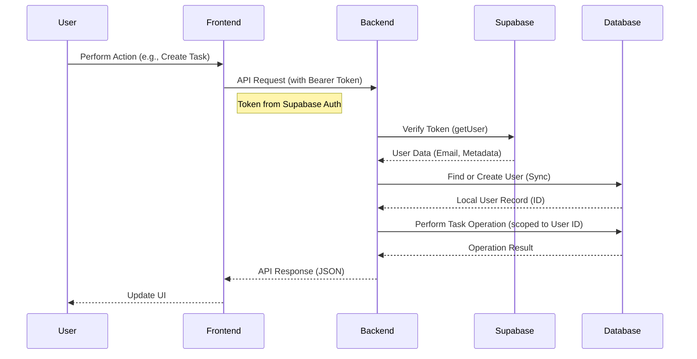
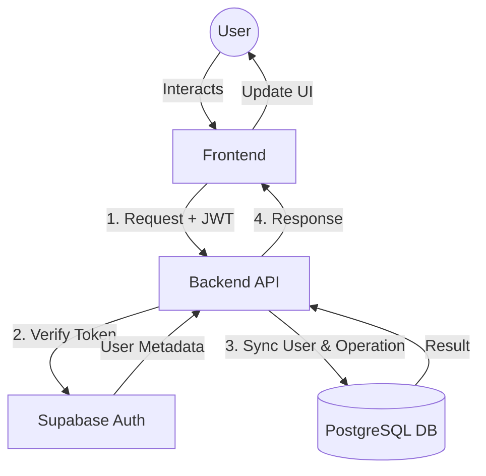
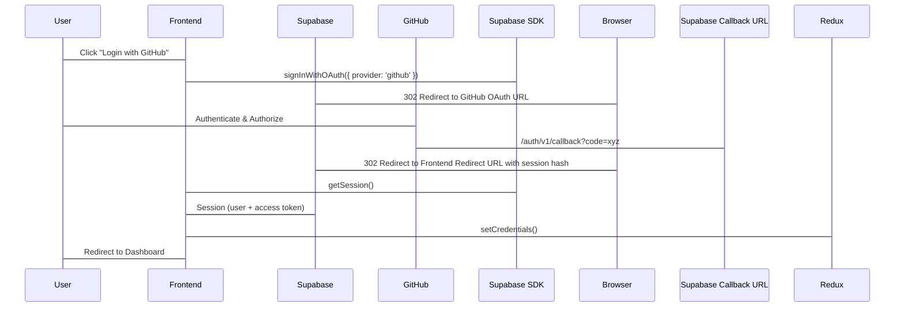

# Task Management Application

MERN stack application with PostgreSQL database.

## Features
- User authentication (JWT)
- Task CRUD operations
- Dashboard with Chart.js statistics
- PostgreSQL database with Sequelize ORM

## Live Demo
- Frontend: 

- Backend API: 

The backend is built with Node.js and Express, providing a RESTful API for secure user authentication and task management. It utilizes Sequelize ORM to interact with the PostgreSQL database.

## Request Flow

The application follows a secure request flow integrating Supabase for authentication and a local PostgreSQL database for data persistence.

### System Interaction Flow

## Login Flow

The application uses GitHub OAuth via Supabase for authentication.

1.  **Initiation**: User clicks login button.
2.  **Redirect**: App redirects to GitHub via Supabase.
3.  **Authentication**: User signs in on GitHub.
4.  **Callback**: GitHub calls back Supabase, which redirects to the app with a session hash.
5.  **Session Restoration**: `AuthWrapper` detects the session, fetches user details, and updates the global state.

## Local Development
[Your local setup instructions]
add env 
    PORT=5000
    NODE_ENV=development
    JWT_SECRET=your_jwt_secret
    DB_NAME=your_db_name
    DB_USER=your_db_user
    DB_PASSWORD=your_db_password
    DB_HOST=localhost
    DB_PORT=5432
    SUPABASE_URL=your_supabase_connection_string

